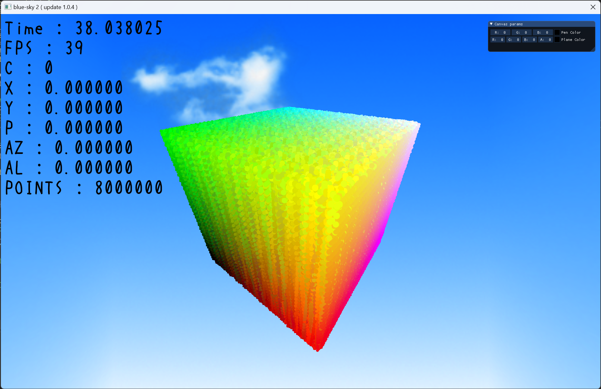
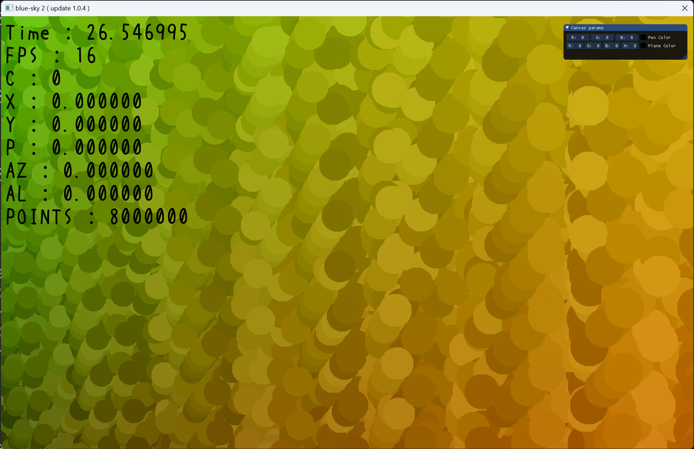

# blue-sky memo 2023

---

## 2023-05-11

手描き風の映像の表現方法を検討。

CanvasTestScene で大量のポイントスプライトを表示してみる。

グラフィックスカードは Radeon RX 6800 XT

点が 800 万個 ( 200 * 200 * 200 ) のとき、 FPS は 13 ～ 41

点が 337 万個 ( 150 * 150 * 150 ) のとき、 FPS は 35 ～ 60

点が 100 万個 ( 100 * 100 * 100 ) のとき、 FPS は 60 で安定。

FullHD ( 1920 * 1080 ) の画面のピクセル数は 207 万。全てをポイントスプライトで表現するのは厳しそう。
そのため、使うにしても一部に留める必要がありそう。

